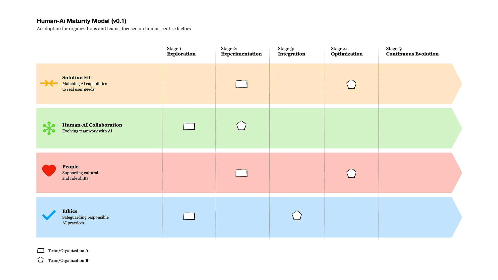
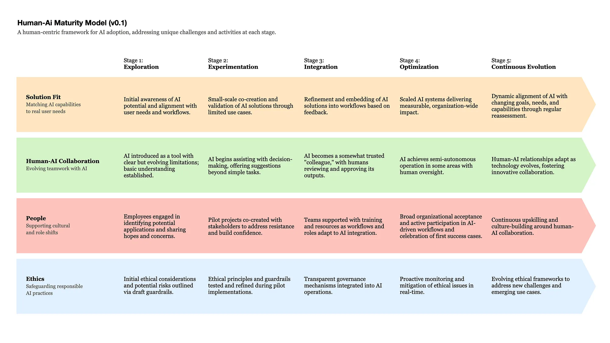

# The Human-AI Maturity Model: Rethinking AI Adoption with People at the Core

HAIMM v0.1, as published. See `SOURCE.md` for provenance, known defects and the
capture method. Do not correct this file. Issues found here are fixed in v0.2.

Author: Carlos Rosemberg
Published: 24 December 2024

---

The main promise of AI agents (AI systems with higher levels of autonomy designed to perform tasks. See [here](https://www.ibm.com/think/topics/ai-agents), [here](https://zapier.com/blog/ai-agent/) and [here](https://en.wikipedia.org/wiki/Intelligent_agent#Agent_environments)) is to dramatically boost productivity of teams. However, as companies are starting to integrate these technologies more deeply into workflows (*Edit: see "[Hybrid workers](https://www.goldmansachs.com/insights/articles/what-to-expect-from-ai-in-2025-hybrid-workers-robotics-expert-models)" report from Goldman Sachs*), they also raise crucial questions: Can we trust them? How do they align with aspects such as ethical standards? And most importantly, **how will they reshape the roles of humans and AI in collaborative work environments**?

To help drive the conversation around AI agents in the workplace, this article introduces a framework called HAIMM (Human AI Maturity Model), focusing less on technological capabilities and more on **human-AI collaboration, cultural shifts**, **real-world** **user needs**, and **ethical concerns**.

This piece is especially relevant for teams and organizations adopting or planning to expand their use of AI agents. However, it also offers valuable insights for AI solution providers, consultancies helping with implementation, and product teams developing AI-powered features.

## Why Do We Need a Human-AI Collaboration Maturity Model?

There are numerous AI maturity models available today, including Gartner's, Forrester's, Deloitte's, Element AI's, Microsoft's, and IBM's AI Ladder (links below). These frameworks provide valuable guidance for evaluating an organization's technological and operational readiness to adopt AI. For example:

- [**Deloitte's Readiness & Management Framework (aiRMF)**](https://www2.deloitte.com/content/dam/Deloitte/us/Documents/public-sector/ai-readiness-and-management-framework.pdf)**:** Evaluates AI adoption in terms of strategic, operational, and ethical readiness (Deloitte, 2023).
- [**Element AI's AI Maturity Model**](https://s3.amazonaws.com/external_clips/3430107/AI-Maturity-Framework_White-Paper_EN.pdf): Focuses on identifying gaps in AI readiness and fostering decision-making improvements (Element AI, 2023).
- [**Forrester's AI Maturity Model**](https://www.forrester.com/blogs/determine-your-readiness-for-ai-with-the-robotics-quotient-maturity-assessment-at-ti-na/)**:** Examines how businesses can leverage AI for insights and decision-making across novice to visionary levels (Forrester, 2023).
- [**Gartner's AI Maturity Model**](https://www.gartner.com/en/documents/3982174)**:** Focuses on benchmarking AI capabilities and progressing through systematic levels of awareness, operationalization, and transformation (Gartner, 2023).
- [**IBM's AI Ladder**](https://www.ibm.com/downloads/documents/us-en/10c31775a0d4023d)**:** Emphasizes the progression through data readiness, AI experimentation, operationalization, and optimization to achieve enterprise-wide AI maturity (Thomas et al., 2019).
- [**IBM's AI maturity framework for enterprise applications**](https://www.ibm.com/downloads/documents/us-en/107a02e948c8f48d): Prescribes a methodology for assessing business and technical aspects of AI (Vaish et al., 2021).
- [**Microsoft's Responsible AI Maturity Model**](https://www.microsoft.com/en-us/research/publication/responsible-ai-maturity-model/)**:** Provides a strong ethical foundation for responsible AI governance at scale (Microsoft, 2023).

These models provide robust frameworks that organizations can use to guide AI adoption at various levels of maturity. They address critical factors such as technological readiness, data governance, operational scalability, and ethical oversight. Each offers a structured pathway for organizations to integrate AI effectively into their workflows.

**So why propose another AI maturity model?**

The Human-AI Maturity Model (HAIMM) is not intended to replace or critique these frameworks. Instead, it builds upon and aims to complement them by zooming in on aspects closely related to **human-AI collaboration**. HAIMM focuses on the interplay between humans and AI systems, or how organizations and teams interact with, trust, and evolve alongside AI tools. This perspective adds a layer of depth to the broader goals of existing maturity models by emphasizing cultural shifts, collaboration dynamics, and ethical considerations through a human-centric lens.

## Human-AI Maturity Model (HAIMM)

In essence, HAIMM works alongside existing models to ensure that AI adoption is not only operationally efficient but also empowering for the people who work with these systems. It seeks to address the nuances of how humans and AI can collaborate symbiotically, fostering trust, productivity, and ethical use in a way that complements the more technical and operational focuses of established frameworks.

HAIMM is comprised of two elements:

1. **Stages,** a perspective highlighting how teams/organizations progress over time. It consists of *Exploration, Experimentation, Integration, and Continuous Evolution.*
2. **Dimensions**, or the building blocks ensuring human centricity: *Solution Fit, Human-AI Collaboration, People, and Ethics*. Each dimension has unique challenges depending on the stage.

*Human-AI Maturity Model (v0.1). AI adoption for organizations and teams, focused on human-centric dimensions (Solution Fit, Human-AI Collaboration, People, and Ethics) across stages (Exploration, Experimentation, Integration, Optimization, and Continuous Evolution).*

A visualization highlighting the specific challenges and activities at each stage is presented later in the article. Let's now explore HAIMM *Stages* and *Dimensions* in details.

## Stages of HAIMM

The HAIMM framework outlines a natural progression for organizations as they adopt and integrate AI. These stages balance human-centric approaches with technological advancements, ensuring AI systems address real needs while fostering trust and collaboration. While presented sequentially, the stages are iterative, reflecting the complexity of real-world AI adoption.

**Stage 1: Exploration**
This stage focuses on identifying opportunities, understanding user needs and concerns, and setting initial guardrails.

**Stage 2: Experimentation**
In this stage, organizations pilot AI tools on a small scale to validate their relevance and effectiveness.

**Stage 3: Integration**
This stage involves embedding AI into workflows and fostering collaboration between teams and AI tools.

**Stage 4: Optimization**
Organizations scale successful AI implementations, focusing on measurable outcomes like productivity, quality, and learning.

**Stage 5: Continuous Evolution**
AI adoption is an ongoing journey. This stage highlights adaptability as organizational needs and technologies evolve.

This structure, composed by a beginning, middle, and end, along with preceding and follow-up stages, is inspired by patterns seen in many transformation frameworks. This approach reflects a natural progression that is intuitive for organizations and individuals navigating complex changes. Adopting this familiar structure balances simplicity with a solid foundation.

## Dimensions of HAIMM

Dimensions serve as the foundational elements that reinforce human-centricity, evolving through HAIMM stages. They consist of *Solution Fit*, *Human-AI Collaboration*, *People*, and *Ethics*.

### 1. Solution Fit: Aligning AI with Real User Needs

One of the main risks in AI adoption is implementing solutions that fail to address real-world problems. The **Solution Fit** dimension ensures that AI capabilities, data, and processes are aligned with user needs at every stage. In other words, teams need to balance between *demand pull* (user/market needs) and *technology push* (technological innovations). Even though the recent developments of Generative AI are clearly a technological push and create entirely new opportunities, focusing disproportionally on its capabilities without attaching them to user pains and gains can be a costly mistake.

In terms of **user needs**, conducting proper UX Research is fundamental to avoid waste of resources or trying to force AI adoption for the sake of it. Here, well-stablished frameworks such as *Jobs-To-Be-Done* can be extremely valuable, as well as *Design Thinking* activities.

In terms of **capabilities**, it's important to consider that AI works in a *jagged frontier,* where AI is capable of performing tasks inside a certain range, but struggles with tasks outside of it (Mollick, 2023). That resonates with the still valid *Moravec's Paradox* which states that what's easy for humans isn't necessarily easy for machines, and vice versa (Moravec, 1988). For example, AI programs like AlphaZero can outplay the best human chess grandmasters, demonstrating strategic depth and precision. Yet, robots still find it challenging to physically move objects with the grace and dexterity of a human hand.

Finally, the match between user needs and AI capabilities are not a guarantee that AI will be seamlessly adopted; other factors are in play. The Technology Acceptance Model (TAM) (Davis, 1989) posits that *Perceived Usefulness* and *Perceived Ease of Use* determine an individual's intention to use a technology, which subsequently influences actual usage behaviour. Building upon TAM, the Unified Theory of Acceptance and Use of Technology (UTAUT) (Venkatesh et al., 2003), identifies four core determinants of technology acceptance: *Performance Expectancy, Effort Expectancy, Social Influence, and Facilitating Conditions*.

Building on all of the factors above, we have:

- **Exploration:** Organizations evaluate their readiness for AI while uncovering both opportunities and potential risks. The goal is to build a foundational understanding of where AI fits into existing workflows and processes. In other words, how AI can enhance job performance (Performance Expectancy) and ensuring it aligns with workflows (Perceived Usefulness). Conducting user research to uncover pain points and opportunities is the key activity. *Example:* Running internal workshops to gather feedback from employees about inefficiencies in current workflows where AI could assist.
- **Experimentation:** Co-creation with the highest possible number of people is essential, as it fosters creativity and confidence. Iterative testing helps refine tools, address usability challenges, and build confidence in AI capabilities before broader deployment. Pilot programs consider both Effort Expectancy (the ease of using the AI) and Social Influence, ensuring that peer feedback supports adoption. Training and support are provided to build user confidence. *Example:* Piloting an AI tool for automating meeting scheduling and evaluating user satisfaction.
- **Integration:** AI tools are refined based on user feedback to ensure seamless integration into workflows. Making necessary resources available (Facilitating Conditions) such as easy access to frontier AI models and systems also supports adoption. Clear roles and responsibilities are defined to ensure AI complements human efforts. *Example:* Adjusting an AI-powered CRM tool to better align with sales team needs after initial deployment feedback.
- **Optimization:** This stage emphasizes fine-tuning systems and ensuring they deliver consistent value across the organization. Measuring the impact of AI on user outcomes and organizational goals is crucial. *Example:* Using analytics to assess how an AI-powered document summarization tool improves reporting efficiency.
- **Continuous Evolution:** Regularly reassessing user needs to ensure AI remains relevant and effective. Regular reviews and updates ensure that AI systems remain aligned with user needs and deliver sustained impact. *Example:* Conducting quarterly surveys to understand how employees' interaction with AI tools evolves over time.

### 2. Human-AI Collaboration: Building a Symbiotic Relationship

In the HAIMM proposed approach, two aspect stand out about Human-AI collaboration: *Interaction mode*, or how people view and interact with AI, and *levels of automation*, or the spectrum of control in human-machine interactions defining how tasks are divided and decisions are made.

**Human-AI Interaction Mode**

Effective AI adoption is as much about teamwork as it is about technology. In the HAIMM framework, AI is envisioned not just as a tool but as a highly capable "team member" joining the team. Depending on the context, AI can take on various roles, such as (Nielsen, 2024):

- **Teacher:** Facilitating learning by sharing knowledge or providing real-time training.
- **Coach:** Offering guidance and constructive feedback to help team members improve their skills and decision-making.
- **Colleague:** Collaborating side-by-side with humans, contributing to shared tasks and decisions as an integrated part of the team.

With the arrival of a new team member, team dynamics may change. In this way, Tuckman's team formation model (Tuckman, 1965 and MIT Human Resources), can provide a framework for understanding the dynamics of human-AI collaboration as they evolve. The framework is divided into:

- **Forming:** Team members come together, establish roles, and set expectations, often characterized by politeness and a lack of deep collaboration.
- **Storming:** Conflicts arise as team members assert their opinions and address differences, leading to challenges in alignment and trust.
- **Norming:** Teams develop mutual understanding, establish norms, and build trust, enabling smoother collaboration and role clarity.
- **Performing:** Teams reach peak efficiency, working cohesively to achieve their goals with minimal friction.
- **Adjourning:** Teams disband or transition as objectives are completed, reflecting on their journey and outcomes.

**Levels of Automation**

Parasuraman, Sheridan, and Wickens (2000) proposed a ten-level taxonomy of automation for decision and action selection, which describes how much control is allocated between humans and machines in the decision-making process. These levels range from fully manual to fully automated, providing a gradient for the degree of human involvement.

*Simple four-stage model of human information processing (Parasuraman, Sheridan, and Wickens, 2000)*

At the higher level of automation we start to see what Christopher Noessel (2017) calls "**agentive**" technology, designed to act on behalf of users, taking initiative to accomplish tasks autonomously. For instance, an AI system that analyses customer feedback (email, social media) in real time and provides a notification + report to users with a deeper analysis and suggested next actions.

Ethan Mollick's (2023) **"Centaur" and "Cyborg" metaphors** provide a complementary lens to automation levels, framing how humans and AI collaborate. The **Centaur** metaphor represents a clear division of labor between human and AI tasks, much like the mythical creature's distinct human and animal halves. In contrast, the **Cyborg** metaphor illustrates a deeply integrated approach, where human and AI efforts are seamlessly intertwined, functioning as if they were a single entity.

**Human-AI Collaboration in the HAIMM stages**

Teams and organizations should aim to identify the optimal combination of the previously mentioned **interaction modes** and **levels of automation,** for their specific needs. Based on that, HAIMM frames the evolving relationship between humans and AI as team members as they progress through the five stages of team development:

- **Exploration (Forming):** Introducing teams to AI tools and setting initial expectations. At this stage, AI typically operates at lower levels of automation, often as an assistant or tool. Teams focus on understanding how AI fits into their workflows, with initial boundaries identified. *Example:* Introducing teams to simple assistants/chat interfaces were they can test simple prompts to assist on various tasks, such as summarization, text rewriting, etc.
- **Experimentation (Storming):** Differences in expectations and roles surface. Addressing challenges as roles between humans and AI become defined. First use cases where AI may start proposing options or offering suggestions, nudging toward shared control (in a "Centaur" or "Cyborg" style), start to appear. *Example:* A marketing team uses an AI tool to suggest campaign ideas based on audience data, which sparks debate over creativity versus automation.
- **Integration (Norming):** Teams develop trust and clear norms for collaboration with AI. Here, AI might act as a colleague in most use cases, proposing and even executing actions with human approval. *Example:* Developers use an AI tool to identify bugs and suggest code improvements, creating a shared process for reviewing and implementing changes.
- **Optimization (Performing):** Collaboration reaches a point where AI operates semi-autonomously, complementing human efforts seamlessly to achieve high performance. *Example:* AI autonomously adjusts supply chain logistics while keeping human managers informed for critical oversight.
- **Continuous Evolution (Adjourning/Transforming):** Teams reflect on their collaboration models and adapt as AI capabilities evolve. Higher levels of automation may emerge as trust grows. *Example:* Based on feedback loops, training programs are redesigned with AI-driven personalization to meet evolving employee needs.

Note that in all stages we have use cases in all automation levels. The emphasis remains on finding the right balance to maximize productivity, foster creativity, and ensure ethical use.

### 3. People: Addressing Cultural and Individual Impacts Through Co-Creation

AI adoption is not just a technical shift; it's a cultural transformation. Drawing from Virginia Satir's change model (Satir et al., 1991; WalkMe Team, 2024), HAIMM acknowledges the emotional journey that individuals and teams undergo during this transition. To provide context, Satir's model outlines five distinct stages, each representing a critical phase in the process of change:

1. **Late Status Quo:** The established state before any change, where existing routines and practices feel stable and predictable.
2. **Resistance:** The initial reaction to disruption, often characterized by pushback as individuals grapple with the uncertainty of change.
3. **Chaos:** A transitional phase marked by confusion, instability, and adaptation as old ways are dismantled and new ones emerge.
4. **Integration:** The stage where new practices begin to take shape, becoming part of daily routines as individuals and teams adjust to the change.
5. **New Status Quo:** A re-established state of stability, where the change has been fully assimilated, often resulting in higher performance and improved outcomes.

*Virginia Satir's change model illustrates the emotional and cultural journey of change, progressing through stages of disruption, adaptation, and eventual stability at a higher performance level.*

This model offers a powerful framework for understanding the emotional and behavioral dynamics of change, shedding light on how individuals and teams navigate transformation. The HAIMM approach builds on these insights, emphasizing co-creation and inclusion as strategies to address the challenges that arise during AI adoption. Here's how HAIMM applies this perspective at each stage:

- **Exploration (Late Status Quo):** Current workflows and mindsets dominate. At this point, teams begin to identify inefficiencies and discuss how AI might address them. Transparency and engagement are critical to building trust and reducing uncertainty about AI's role. *Example:* Including staff from multiple departments in brainstorming sessions about potential AI use cases, hopes and fears, without immediately altering existing processes.
- **Experimentation (Resistance):** Individuals may enter the Resistance phase as they grapple with the idea of AI changing established practices. Initial testing and pilots can trigger skepticism or fear, especially if AI challenges existing workflows. To mitigate resistance, organizations should co-create pilots with employees, ensuring their voices are heard and their concerns addressed. *Example:* Sessions with sponsor users to gather detailed feedback during pilot testing of a chatbot for internal support.
- **Integration (Chaos):** As AI tools are integrated into workflows, teams may experience *Chaos*, a phase marked by uncertainty and disruption. Roles and responsibilities may shift, and employees might feel a temporary loss of stability. Clear communication, training, and collaborative adjustments to workflows are essential to guide teams through this stage. Also, encouraging employees to co-create AI-enhanced workflows, and supporting them as they adapt to this new reality. *Example:* Jointly developing a new process for performance reviews that combines AI-assisted insights and managerial input.
- **Optimization (Integration):** Optimization aligns with Satir's Integration phase, where teams begin to embrace AI as a natural part of their workflows. Collaboration between humans and AI becomes smoother, and the benefits of AI adoption, such as improved productivity and quality, become evident. Recognizing and celebrating successes helps reinforce positive change. *Example:* Publicly acknowledging team members who adapted workflows to better utilize AI tools.
- **Continuous Evolution (New Status Quo):** AI is fully embedded and teams are confident in its role. However, this phase also requires ongoing learning and adaptation as new technologies emerge: It's essential to provide growth opportunities that align with evolving roles and career paths in an AI-driven environment as well as building partnerships between AI experts and end-users to ensure long-term success. *Example:* Establishing a cross-functional AI advisory board that meets regularly to discuss improvements.

### 4. Ethics: Ensuring Responsible AI Use

Ethical governance is a foundational element of HAIMM, ensuring fairness, transparency, and accountability throughout the adoption process. It's highly recommended to follow best practices and guidelines from the extensive literature in the field, such as the [European AI Act](https://www.consilium.europa.eu/en/policies/artificial-intelligence/#AI%20act) (European Commission, 2024), [IBM's Foundation Models Risks, Opportunities, and Mitigations](https://www.ibm.com/downloads/documents/us-en/10a99803d8afd656) (IBM, 2024) and [Microsoft's Responsible AI Maturity Model](https://www.microsoft.com/en-us/research/publication/responsible-ai-maturity-model/) (Microsoft, 2024). A high-level co-creation approach on how to explore those guidelines throughout the stages is shown below:

- **Exploration:** Establishing initial ethical guardrails and guidelines, identifying potential risks. *Example:* Conducting reviews and workshops to collaboratively identify risks and define initial guardrails and guidelines.
- **Experimentation:** Designing and Testing AI solutions based the defined ethical standards. *Example:* Using AI ethics frameworks in design sessions and running ethics evaluations on early concept ideas and prototypes.
- **Integration:** Embedding governance mechanisms and transparency protocols into workflows. *Example:* Requiring detailed documentation for all AI-driven decision-making systems.
- **Optimization:** Continuously monitoring AI for ethical concerns and addressing issues proactively. *Example:* Having clear metrics to track compliance with AI ethics guidelines.
- **Continuous Evolution:** Innovating ethical practices to address new challenges and maintain trust. *Example:* Updating transparency policies as AI applications expand into new areas.

These principles ensure that organizations adopt AI in a manner that prioritizes trust, accountability, and ethical responsibility.

### Combining Dimensions and Stages: A Unified View of HAIMM

Aligning the core dimensions (*Solution Fit, Human-AI Collaboration, People, and Ethics*) with the five stages of maturity in a single visualization provides a structured yet flexible approach to navigating the challenges and opportunities, highlighting how these dimensions evolve over time.

*Alignment of the Human-AI Maturity Model v0.1 stages with key dimensions, highlighting how solution fit, human-AI collaboration, people, and ethics evolve throughout the AI adoption journey.*

## Measuring Success: Proposed HAIMM Metrics

Metrics are vital for tracking progress and ensuring successful AI adoption across the stages of HAIMM. As each dimension evolves through the stages, it presents unique challenges, requiring tailored metrics.

Important notes:

- The suggestions below are just a starting point (some are just high-level ideas), so teams should collaboratively define the most relevant metrics for their specific context.
- Take into consideration that metrics can vary drastically in terms of accuracy and data collection effort.
- Focus on just a few metrics to track (3 to 5) per stage at a time.

SOLUTION FIT

1. **Stage 1: Exploration**
   Percentage of workflows assessed for AI readiness.
   Percentage of identified user needs mapped to AI opportunities.
2. **Stage 2: Experimentation**
   Number of pilots successfully co-created and tested.
   Percentage of pilot use cases showing positive outcomes.
3. **Stage 3: Integration**
   Percentage of workflows with integrated AI solutions.
   Usage (Weekly/Monthly Active Users) of AI solutions.
   User feedback scores on AI-enhanced workflows.
4. **Stage 4: Optimization**
   Improvement in key organizational KPIs (e.g., efficiency, quality).
   Percentage reduction in workflow bottlenecks due to AI.
5. **Stage 5: Continuous Evolution**
   Frequency of reassessments to ensure AI alignment with goals.
   User satisfaction scores with evolving AI capabilities.

HUMAN-AI COLLABORATION

1. **Stage 1: Exploration**
   Percentage of employees aware of AI's potential role.
   Number of workshops conducted to introduce AI concepts.
2. **Stage 2: Experimentation**
   Number of decisions influenced by AI assistance.
   Percentage of pilot tasks completed collaboratively with AI.
3. **Stage 3: Integration**
   Ratio of AI-assisted decisions approved vs. adjusted by humans.
   Trust score surveys reflecting employee confidence in AI outputs.
4. **Stage 4: Optimization**
   Percentage of semi-autonomous tasks successfully completed by AI.
   Percentage of team workflows optimized by AI.
5. **Stage 5: Continuous Evolution**
   Frequency of human-AI collaboration reviews.
   Number of innovative human-AI collaboration models implemented.

PEOPLE

1. **Stage 1: Exploration**
   Percentage of employees engaged in workshops or consultations.
   Percentage of employees expressing interest in AI-related opportunities.
2. **Stage 2: Experimentation**
   Percentage of stakeholders involved in pilot co-creation.
   Percentage of employees expressing increased openness to using AI.
3. **Stage 3: Integration**
   Completion rate of AI training programs by employees.
   Percentage of employees adapting successfully to new workflows.
4. **Stage 4: Optimization**
   Percentage of employees reporting improved productivity.
   Percentage of employees actively using AI in daily tasks.
5. **Stage 5: Continuous Evolution**
   Number of skill gaps related to new AI advancements.
   Number of employees participating in continuous training programs.

ETHICS

1. **Stage 1: Exploration**
   Percentage of potential risks identified during initial assessment.
   Percentage of workflows reviewed for ethical risks.
2. **Stage 2: Experimentation**
   Number of ethical issues identified and resolved during pilots.
   Percentage of pilot designs incorporating ethical guardrails.
3. **Stage 3: Integration**
   Frequency of transparency audits conducted.
   Percentage of AI workflows adhering to established ethical guidelines.
4. **Stage 4: Optimization**
   Number of ethical violations mitigated through monitoring.
   Frequency of real-time updates to ethical guidelines.
5. **Stage 5: Continuous Evolution**
   Frequency of updates to governance frameworks based on new challenges.
   Number of new ethical principles adopted for emerging use cases.

## Final Thoughts

In its debut version (0.1), the Human-AI Maturity Model (HAIMM) is not a replacement for existing AI maturity frameworks but a complementary lens focusing on human-AI collaboration. Its main proposal is to emphasize dimensions such as solution fit, cultural impacts, and ethical governance, showing how they evolve in stages. That ensures that AI adoption empowers individuals and teams while aligning with broader organizational goals.

This article has only scratched the surface of this complex and fascinating topic. Future discussions and iterations of HAIMM could explore areas such as:

- Step-by-step strategies for implementing HAIMM within different organizational contexts.
- Templates and tools to facilitate adoption.
- Real-world examples that demonstrate the model's impact in diverse industries.

For now, reflect on your organization's AI journey: Are your AI solutions addressing real user needs? Are your teams equipped to collaborate effectively with AI? Have you embedded ethical practices throughout your workflows? These questions are a starting point for fostering a future where humans and AI can thrive together. That means collaborating not as tools and users, but as partners in achieving meaningful outcomes.

## References

1. Council of the European Union. (2024). Artificial intelligence act. Retrieved from https://www.consilium.europa.eu/en/policies/artificial-intelligence/#AI%20act
2. Davis, F. D. (1989). Perceived usefulness, perceived ease of use, and user acceptance of information technology. *MIS Quarterly*, 13(3), 319-340. Retrieved from https://doi.org/10.2307/249008
3. Deloitte. (2023). AI Maturity Framework. Retrieved from https://www2.deloitte.com/content/dam/Deloitte/us/Documents/public-sector/ai-readiness-and-management-framework.pdf
4. Element AI. (2023). AI Maturity Framework [White paper]. Retrieved from https://s3.amazonaws.com/external_clips/3430107/AI-Maturity-Framework_White-Paper_EN.pdf
5. IBM. (2024). Foundation models: Opportunities, risks and mitigations. https://www.ibm.com/downloads/documents/us-en/10a99803d8afd656
6. Forrester. (2023). AI Maturity Assessment. Retrieved from https://www.forrester.com/blogs/determine-your-readiness-for-ai-with-the-robotics-quotient-maturity-assessment-at-ti-na/
7. Gartner. (2023). AI Maturity Model. Retrieved from https://www.gartner.com/en/documents/3982174
8. Gutowska, A. (2024, July 3). *What are AI agents?* IBM. Retrieved from https://ibm.com/think/topics/ai-agents
9. Microsoft. (2023). Responsible AI Maturity Model. Retrieved from https://www.microsoft.com/en-us/research/publication/responsible-ai-maturity-model/
10. MIT Human Resources. (n.d.). Using the stages of team development. *MIT Human Resources*. Retrieved from https://hr.mit.edu/learning-topics/teams/articles/stages-development
11. Mollick, E. (2023). Centaurs and cyborgs on the jagged frontier: I think we have an answer on whether AIs will reshape work. *One Useful Thing*. Retrieved from https://www.oneusefulthing.org/p/centaurs-and-cyborgs-on-the-jagged
12. Moravec, H. (1988). Mind Children: The Future of Robot and Human Intelligence. United Kingdom: Harvard University Press.
13. Nielsen, J. (2024). *4 metaphors to help you work with AI*. UX Tigers. Retrieved from https://www.uxtigers.com/post/4-metaphors-work-with-ai
14. Noessel, C. (2017). *Designing agentive technology: AI that works for people*. Rosenfeld Media.
15. Rebelo, M. (2024, May 17). *What are AI agents? A comprehensive guide*. Zapier. Retrieved from https://zapier.com/blog/ai-agent/
16. R. Parasuraman, T. B. Sheridan and C. D. Wickens, "A model for types and levels of human interaction with automation," in *IEEE Transactions on Systems, Man, and Cybernetics - Part A: Systems and Humans*, vol. 30, no. 3, pp. 286-297, May 2000, doi: 10.1109/3468.844354. Retrieved from https://ieeexplore.ieee.org/abstract/document/844354
17. Satir, V., Banmen, J., Gerber, J., & Gomori, M. (1991). *The Satir model: Family therapy and beyond*. Palo Alto, CA: Science and Behavior Books.
18. Thomas, J., et al. (2019). The AI Ladder: Demystifying AI challenges and how to overcome them. *IBM Research*. Retrieved from https://www.ibm.com/downloads/documents/us-en/10c31775a0d4023d
19. Tuckman, B. W. (1965). Developmental sequence in small groups. *Psychological Bulletin*, 63(6), 384-399. Retrieved from https://doi.org/10.1037/h0022100
20. Vaish, R., Agrawal, A., Kapoor, S., & Parkin, R. (2021). *AI maturity framework for enterprise applications*. IBM AI Applications. https://www.ibm.com/downloads/documents/us-en/107a02e948c8f48d
21. Venkatesh, V., Morris, M. G., Davis, G. B., & Davis, F. D. (2003). User acceptance of information technology: Toward a unified view. *MIS Quarterly*, 27(3), 425-478. Retrieved from https://doi.org/10.2307/30036540
22. WalkMe Team. (2024). Satir Change Model: A Guide For Effective Change Management. *WalkMe Change Management Blog*. Retrieved from https://change.walkme.com/satir-change-model/
23. Wikipedia contributors. (n.d.). *Intelligent agent - Agent environments*. In *Wikipedia, The Free Encyclopedia*. Retrieved January 30, 2025, from https://en.wikipedia.org/wiki/Intelligent_agent#Agent_environments

---

**Disclaimer:**
The opinions expressed in this blog post are solely my own and do not reflect the views or positions of my employer or any affiliated organizations. This content is intended for informational and discussion purposes only.

Have feedback or ideas to share about the Human-AI Maturity Model?
Drop a comment below or join me on LinkedIn (https://www.linkedin.com/in/rosemberg) to continue the discussion.
