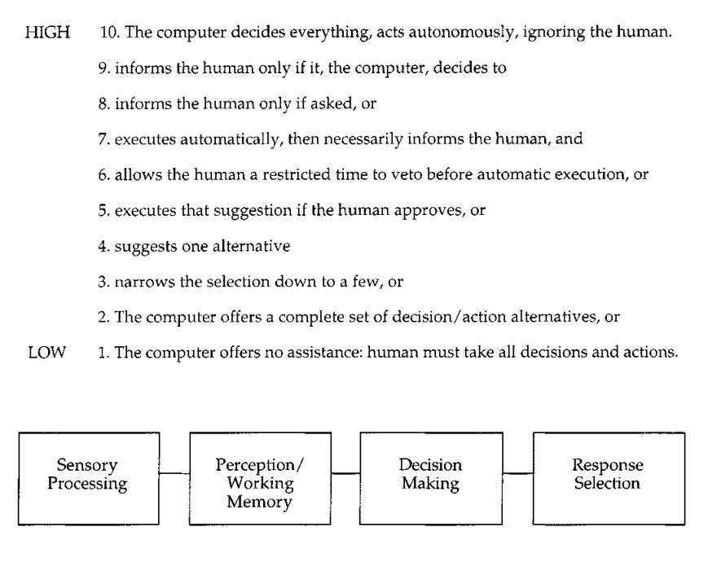

# Human-AI Collaboration

*Evolving teamwork with AI*

**Status: v0.1 text, moved but not yet revised for v0.2.** Gates drafted, untested against a real assessment.

In the HAIMM proposed approach, two aspect stand out about Human-AI collaboration: *Interaction mode*, or how people view and interact with AI, and *levels of automation*, or the spectrum of control in human-machine interactions defining how tasks are divided and decisions are made.

**Human-AI Interaction Mode**

Effective AI adoption is as much about teamwork as it is about technology. In the HAIMM framework, AI is envisioned not just as a tool but as a highly capable "team member" joining the team. Depending on the context, AI can take on various roles, such as (Nielsen, 2024):

- **Teacher:** Facilitating learning by sharing knowledge or providing real-time training.
- **Coach:** Offering guidance and constructive feedback to help team members improve their skills and decision-making.
- **Colleague:** Collaborating side-by-side with humans, contributing to shared tasks and decisions as an integrated part of the team.

With the arrival of a new team member, team dynamics may change. In this way, Tuckman's team formation model (Tuckman, 1965 and MIT Human Resources), can provide a framework for understanding the dynamics of human-AI collaboration as they evolve. The framework is divided into:

- **Forming:** Team members come together, establish roles, and set expectations, often characterized by politeness and a lack of deep collaboration.
- **Storming:** Conflicts arise as team members assert their opinions and address differences, leading to challenges in alignment and trust.
- **Norming:** Teams develop mutual understanding, establish norms, and build trust, enabling smoother collaboration and role clarity.
- **Performing:** Teams reach peak efficiency, working cohesively to achieve their goals with minimal friction.
- **Adjourning:** Teams disband or transition as objectives are completed, reflecting on their journey and outcomes.

**Levels of Automation**

Parasuraman, Sheridan, and Wickens (2000) proposed a ten-level taxonomy of automation for decision and action selection, which describes how much control is allocated between humans and machines in the decision-making process. These levels range from fully manual to fully automated, providing a gradient for the degree of human involvement.

*Simple four-stage model of human information processing (Parasuraman, Sheridan, and Wickens, 2000)*

At the higher level of automation we start to see what Christopher Noessel (2017) calls "**agentive**" technology, designed to act on behalf of users, taking initiative to accomplish tasks autonomously. For instance, an AI system that analyses customer feedback (email, social media) in real time and provides a notification + report to users with a deeper analysis and suggested next actions.

Ethan Mollick's (2023) **"Centaur" and "Cyborg" metaphors** provide a complementary lens to automation levels, framing how humans and AI collaborate. The **Centaur** metaphor represents a clear division of labor between human and AI tasks, much like the mythical creature's distinct human and animal halves. In contrast, the **Cyborg** metaphor illustrates a deeply integrated approach, where human and AI efforts are seamlessly intertwined, functioning as if they were a single entity.

**Human-AI Collaboration in the HAIMM stages**

Teams and organizations should aim to identify the optimal combination of the previously mentioned **interaction modes** and **levels of automation,** for their specific needs. Based on that, HAIMM frames the evolving relationship between humans and AI as team members as they progress through the five stages of team development:

- **Exploration (Forming):** Introducing teams to AI tools and setting initial expectations. At this stage, AI typically operates at lower levels of automation, often as an assistant or tool. Teams focus on understanding how AI fits into their workflows, with initial boundaries identified. *Example:* Introducing teams to simple assistants/chat interfaces were they can test simple prompts to assist on various tasks, such as summarization, text rewriting, etc.
- **Experimentation (Storming):** Differences in expectations and roles surface. Addressing challenges as roles between humans and AI become defined. First use cases where AI may start proposing options or offering suggestions, nudging toward shared control (in a "Centaur" or "Cyborg" style), start to appear. *Example:* A marketing team uses an AI tool to suggest campaign ideas based on audience data, which sparks debate over creativity versus automation.
- **Integration (Norming):** Teams develop trust and clear norms for collaboration with AI. Here, AI might act as a colleague in most use cases, proposing and even executing actions with human approval. *Example:* Developers use an AI tool to identify bugs and suggest code improvements, creating a shared process for reviewing and implementing changes.
- **Optimization (Performing):** Collaboration reaches a point where AI operates semi-autonomously, complementing human efforts seamlessly to achieve high performance. *Example:* AI autonomously adjusts supply chain logistics while keeping human managers informed for critical oversight.
- **Continuous Evolution (Adjourning/Transforming):** Teams reflect on their collaboration models and adapt as AI capabilities evolve. Higher levels of automation may emerge as trust grows. *Example:* Based on feedback loops, training programs are redesigned with AI-driven personalization to meet evolving employee needs.

Note that in all stages we have use cases in all automation levels. The emphasis remains on finding the right balance to maximize productivity, foster creativity, and ensure ethical use.

## Matrix row

| Stage | Cell |
|---|---|
| Exploration | AI introduced as a tool with clear but evolving limitations; basic understanding established. |
| Experimentation | AI begins assisting with decision-making, offering suggestions beyond simple tasks. |
| Integration | AI becomes a somewhat trusted "colleague," with humans reviewing and approving its outputs. |
| Optimization | AI achieves semi-autonomous operation in some areas with human oversight. |
| Continuous Evolution | Human-AI relationships adapt as technology evolves, fostering innovative collaboration. |

## Gates

Source: `framework/gates/human-ai-collaboration.yaml`. Rendered: `framework/gates/generated/human-ai-collaboration-gates.md`. Instruments: `playbook/instruments/`.

The Integration to Optimization gate carries the Human-AI Collaboration / Knowledge & Context interaction criterion (sufficiency): whether AI can be grounded without a human supplying context in the moment.

## Related

- Full v0.1 text, as published: `archive/v0.1/article.md`
- v0.1 metrics for this dimension: `archive/v0.1/article.md`, not yet migrated; see `research/open-questions.md`, item 2.
