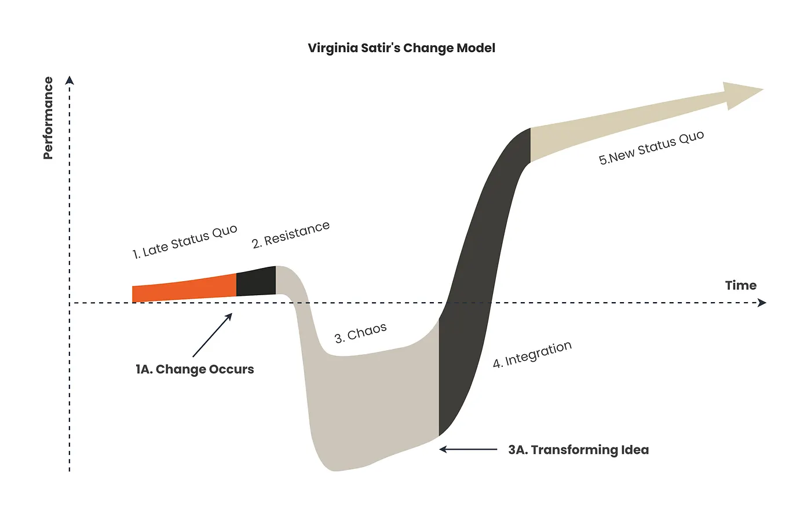

# People

*Supporting cultural and role shifts*

**Status: v0.1 text, moved but not yet revised for v0.2.** Gates drafted, untested against a real assessment.

AI adoption is not just a technical shift; it's a cultural transformation. Drawing from Virginia Satir's change model (Satir et al., 1991; WalkMe Team, 2024), HAIMM acknowledges the emotional journey that individuals and teams undergo during this transition. To provide context, Satir's model outlines five distinct stages, each representing a critical phase in the process of change:

1. **Late Status Quo:** The established state before any change, where existing routines and practices feel stable and predictable.
2. **Resistance:** The initial reaction to disruption, often characterized by pushback as individuals grapple with the uncertainty of change.
3. **Chaos:** A transitional phase marked by confusion, instability, and adaptation as old ways are dismantled and new ones emerge.
4. **Integration:** The stage where new practices begin to take shape, becoming part of daily routines as individuals and teams adjust to the change.
5. **New Status Quo:** A re-established state of stability, where the change has been fully assimilated, often resulting in higher performance and improved outcomes.

*Virginia Satir's change model illustrates the emotional and cultural journey of change, progressing through stages of disruption, adaptation, and eventual stability at a higher performance level.*

This model offers a powerful framework for understanding the emotional and behavioral dynamics of change, shedding light on how individuals and teams navigate transformation. The HAIMM approach builds on these insights, emphasizing co-creation and inclusion as strategies to address the challenges that arise during AI adoption. Here's how HAIMM applies this perspective at each stage:

- **Exploration (Late Status Quo):** Current workflows and mindsets dominate. At this point, teams begin to identify inefficiencies and discuss how AI might address them. Transparency and engagement are critical to building trust and reducing uncertainty about AI's role. *Example:* Including staff from multiple departments in brainstorming sessions about potential AI use cases, hopes and fears, without immediately altering existing processes.
- **Experimentation (Resistance):** Individuals may enter the Resistance phase as they grapple with the idea of AI changing established practices. Initial testing and pilots can trigger skepticism or fear, especially if AI challenges existing workflows. To mitigate resistance, organizations should co-create pilots with employees, ensuring their voices are heard and their concerns addressed. *Example:* Sessions with sponsor users to gather detailed feedback during pilot testing of a chatbot for internal support.
- **Integration (Chaos):** As AI tools are integrated into workflows, teams may experience *Chaos*, a phase marked by uncertainty and disruption. Roles and responsibilities may shift, and employees might feel a temporary loss of stability. Clear communication, training, and collaborative adjustments to workflows are essential to guide teams through this stage. Also, encouraging employees to co-create AI-enhanced workflows, and supporting them as they adapt to this new reality. *Example:* Jointly developing a new process for performance reviews that combines AI-assisted insights and managerial input.
- **Optimization (Integration):** Optimization aligns with Satir's Integration phase, where teams begin to embrace AI as a natural part of their workflows. Collaboration between humans and AI becomes smoother, and the benefits of AI adoption, such as improved productivity and quality, become evident. Recognizing and celebrating successes helps reinforce positive change. *Example:* Publicly acknowledging team members who adapted workflows to better utilize AI tools.
- **Continuous Evolution (New Status Quo):** AI is fully embedded and teams are confident in its role. However, this phase also requires ongoing learning and adaptation as new technologies emerge: It's essential to provide growth opportunities that align with evolving roles and career paths in an AI-driven environment as well as building partnerships between AI experts and end-users to ensure long-term success. *Example:* Establishing a cross-functional AI advisory board that meets regularly to discuss improvements.

## Matrix row

| Stage | Cell |
|---|---|
| Exploration | Employees engaged in identifying potential applications and sharing hopes and concerns. |
| Experimentation | Pilot projects co-created with stakeholders to address resistance and build confidence. |
| Integration | Teams supported with training and resources as workflows and roles adapt to AI integration. |
| Optimization | Broad organizational acceptance and active participation in AI-driven workflows and celebration of first success cases. |
| Continuous Evolution | Continuous upskilling and culture-building around human-AI collaboration. |

## Gates

Source: `framework/gates/people.yaml`. Rendered: `framework/gates/generated/people-gates.md`. Instruments: `playbook/instruments/`.

The Integration to Optimization gate carries the People / Knowledge & Context interaction criterion (distribution): whether capability is concentrated in the people who built personal context scaffolding.

## Related

- Full v0.1 text, as published: `archive/v0.1/article.md`
- v0.1 metrics for this dimension: `archive/v0.1/article.md`, not yet migrated; see `research/open-questions.md`, item 2.
